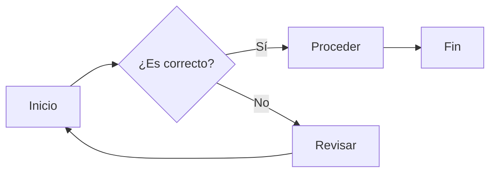
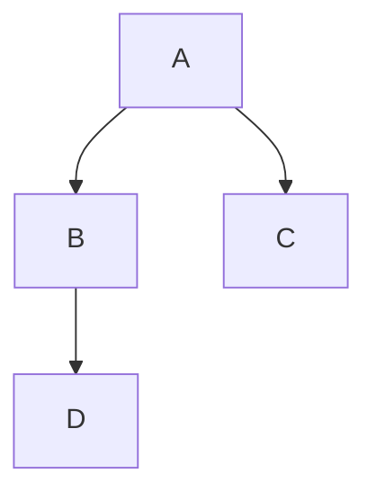

# Ejemplo de un archivo markdown

El siguiente es un ejemplo de una conversion de Markdown .md a .html con pandoc

Este archivo Markdown de ejemplo que cubre muchas funcionese:

~~~
# Título de nivel 1

## Título de nivel 2

### Título de nivel 3

#### Título de nivel 4

##### Título de nivel 5

###### Título de nivel 6
~~~

así se ve:

# Título de nivel 1

## Título de nivel 2

### Título de nivel 3

#### Título de nivel 4

##### Título de nivel 5

###### Título de nivel 6

---

**Texto en negrita**

_Texto en cursiva_

**Texto en negrita y _cursiva_ juntos**

~Texto tachado~

`Código en línea`

```
# Bloque de código en Python
def saludar():
    print("¡Hola Mundo!")
```

---

## Tabla de ejemplo

| Nombre | Edad | Ciudad |
| --- | --- | --- |
| Juan | 25 | Madrid |
| María | 30 | Barcelona |
| Pedro | 28 | Valencia |

---

## Notas

> **Nota importante:** Este es un ejemplo de una **nota** en Markdown.

---

## Referencias

Puedes añadir enlaces en Markdown como este:

- [Google](https://www.google.com/)
- [Wikipedia](https://www.wikipedia.org/)

---

## Fórmulas Matemáticas

Las fórmulas matemáticas se escriben usando LaTeX. Por ejemplo:

- Ecuación cuadrática: _a__x_<sup>2</sup> + _b__x_ + _c_ = 0
    
- Fórmula de la energía cinética: $$ E\_k = \\frac{1}{2} m v^2 $$
    

---

## Fórmulas Químicas

Una fórmula química ejemplo:

- Agua: **H₂O**
- Dióxido de Carbono: **CO₂**
- Ácido Sulfúrico: **H₂SO₄**

---

## Diagramas con Mermaid

Mermaid es útil para crear diagramas dentro de Markdown. Un ejemplo de diagrama de flujo:

~~~

~~~

y así se ve:


otro ejemplo:

~~~

~~~

así se ve:


---

## ASCII Art

Un ejemplo simple de arte ASCII:

```
   /\_/\
  ( o.o )
   > ^ <
```

---

## Citas

> “La vida es lo que pasa mientras estás ocupado haciendo otros planes.” - John Lennon

---

## Listas

### Lista ordenada

1. Primer elemento
2. Segundo elemento
3. Tercer elemento

### Lista desordenada

- Elemento 1
- Elemento 2
- Elemento 3

---

¡Este es un archivo Markdown con muchos de los elementos más comunes! Puedes utilizarlo como base para tus propios proyectos.